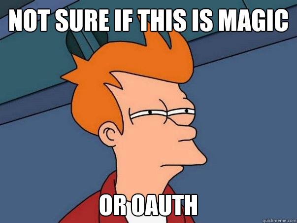
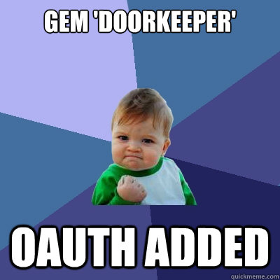
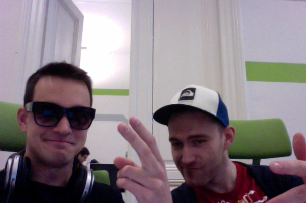
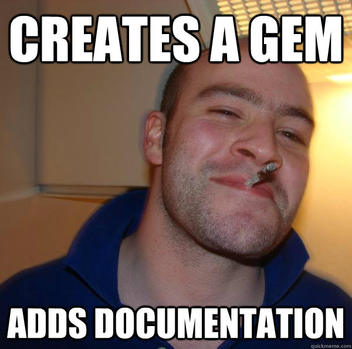

!SLIDE center

!SLIDE center

!SLIDE center

!SLIDE center

!SLIDE center

!SLIDE center

!SLIDE center
    @@@ ruby
    gem 'doorkeeper'
    rails generate doorkeeper:install
    rake db:migrate

!SLIDE smaller
    @@@ ruby
    Doorkeeper.configure do
      resource_owner_authenticator do |routes|
        current_user ||
        redirect_to('/sign_in', :alert => "Needs sign in.")
      end
    end

!SLIDE smaller
    @@@ ruby
    class Api::V1::ProductsController < Api::V1::ApiController
      doorkeeper_for :all

      def index; end
    end

!SLIDE center
# Awesome developers

!SLIDE center

!SLIDE center

